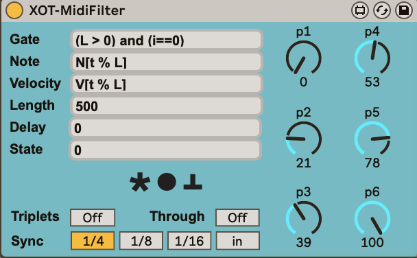

# XOT-MidiFilter

Max for Live MIDI Filter effect.

(c) Jaap-Henk Hoepman (info@xot.nl)

Released under the [MIT](https://opensource.org/licenses/MIT) license. 

## Summary

XOT-MidiFilter uses user supplied expressions to transform incoming MIDI notes, or to generate MIDI notes when triggered by an external clock. 

It can be used to shift notes, adjust note velocities, delay notes, create rhythmic patterns, process incoming chords as an arpeggiator, and much much more. The use of complex LUA expressions allow these things to depend on the current state, on random events, and the value of three dials.

## Description

XOT-MidiFilter is triggered to produce output with every clock tick. This tick is either derived from the running transport (when 'Sync' equals 1/4, 1/8 or 1/16) or triggered with each incoming note on (when 'Sync' equals 'in'). When 'Triplets' is on, the clock is synchronised on triples of the selected rate. 

When setting 'Sync' to 'in', an incoming MIDI note-on message (i.e. with velocity > 0) is immediately processed. In the expressions generating the output (see below), `N[0]` equals the note, `V[0]` its velocity, and `L=1`. This setting allows the generation of rhythmic patterns with a grove driven by notes on a MIDI track. 

When 'Sync' is equal to 1/4, 1/8 or 1/16 (i.e. when XOT-MidiFilter is synced to the transport), incoming notes are stored in a chord. A note is added with a note on message, and removed with a note off message. When a note is added, its velocity is also recorded. XOT-MidiFilter can use the currently stored chord in the expressions that generate its output by referring to `N[i]` for the i-th note, `V[i]` for the velocity of the i-th note, for i between 0 and `L`-1 (i.e. `L` denotes the number of notes in the current chord). Notes in a chord are always stored in increasing note pitch, i.e. `N[i]` is guaranteed to be smaller than `N[j]` when `i` < `j`.

With every tick the following happens:

1. All expressions are read from the input.
2. The next state `NS` is computed using the state expression. (If 'Sync' is 'in' this only happens with the first note on message after a note off message was received; this allows incrementally built chords in 'Sync=in' mode to share the same state when creating output.)
3. A loop over all notes in the current chord is started, setting an index
   `i` through values `0` to `L`-1 one by one, and performing the following steps. If the current chord is empty (or when 'Sync' equals 'in'), the steps below are executed once, for `i` equals 0.
   
   - The gate expression is executed, and if it returns `false`, no output is produced. (Recall that `t` can be used in this expression for the current clock tick number, while `i` can be used to refer to the index of the current note in the current chord.)
   
   - Otherwise, a note on MIDI output message is created with pitch defined by the note expression, velocity defined by the velocity expression, length defined by the length expression and delayed as defined by the delay expression.
   
   - If the length expression returns 0, then the corresponding note off message is used to turn the note off; this only works if 'Sync' equals 'in'. (If 'Sync' does not equal 'in', the note is on forever). With this setting XOT-MidiFilter acts as a true MIDI note filter.
   
4. The current tick count is incremented by 1.
5. The current state `S` is set to the next state `NS` computed earlier.

Users can define the following expressions.

Gate
: Must return a boolean. When `true`, an output is generated based on the results of the other expressions. 

Note
: Must return a note value, floating point values are rounded from below to integers. Defines the note to be output.

Velocity
: Must return a velocity value, floating point values are rounded from below to integers. Defines the velocity of the note to be output.

Length
: Length in milliseconds, floating point values are rounded from below to integers. Defines the length of the note to be output (a note off will be sent that much time later).

Delay
: Delay in milliseconds, floating point values are rounded from below to integers. Defines the delay before the note is actually output (the corresponding note off is similarly delayed).

State
: State as an integer. Defines next state ns (which becomes state s after all expressions have been evaluated for all notes in the current chord.

In the function definitions the following variables can be used.

- `t`: clock tick number, starts at 0.
- `i`: current chord note index, between 0 and `L`-1.
- `L`: current chord length.
- `N[i]`: current chord note at index `i`.
- `V[i]`: current chord note velocity at index `i`.
- `S`: the current state.
- `NS`: the new state.
- `p1`, `p2`, `p3`, `p4`, `p5`, `p6`: the values of the three dials (between 0..100).

Moreover, the following helper functions are available.

- `e(n,k,r,i)`: the euclid generatior for n slots, k pulses, with rotation r, returning whether the slot at index i has a pulse or not (boolean). (*Note: the [algorithm used](https://paulbatchelor.github.io/sndkit/euclid/) is a simplified one-line version of the original recursive algorithm, that produces the same pattern but with a fixed but seemingly random rotation; adjust the rotation to get the actual Euclidean pattern.*) 
- `b(v)`: convert a boolean v to 0 (false) or 1 (true).
- `r()`: return a uniform random value between 0..99 (inclusive).
- `div(n,d)`: the integer division of n by d.

When 'Through' equals 'On', all incoming MIDI events are passed through. When 'Off', all are blocked and the output is only as generated by XOT-MidiFilter itself.

## Examples

### Repeat chord with increasing velocity

Set Sync to 1/4, 1/8 or 1/16.

Gate
: `true`; produce output on every tick for every note in the chord.

Note
: `N[i]`; output each note in the chord.

Velocity
: `V[i]+20*(t%3)`; add 0, 20 or 40 to the velocity depending on the tick

Length
: `500`; note length is 500 ms.

Delay
: `0`; no delay.

State
: `0`; not used.

### Randomly shift an incoming chord

Sync should be set to 'in'. 

Gate
: `true`; always produce output

Note
: `N[0]+NS`; output the note applying the current shift. 

Velocity
: `V[0]`; keep velocity

Length
: `0`; notes stay on as long as the key is pressed (i.e. wait for the note off).

Delay
: `0`; no delay.

State
: `5*(r()%3)`; assign random 5-semitone shift to state (which stays constant for all notes in current chord)

Note that when SYnc equals 'in' notes are treated one by one as the come in - so XOT-MidiFilter does not 'see' a chord as it would when synced to the transport. This is why we use N[0] (the incoming note) in the note expression, and we use the state to record the current shift (because when sync equals 'in' the state is only updated with the first note on message after a note off, i.e. when the first note of a new chord comes in when the previous chord was released).

### Arpeggiator (Up)

Set Sync to 1/4, 1/8 or 1/16.

Gate
: `(L > 0) and (i==0)`; produce output on every tick, *once* for the chord (if there is a chord at all). Note that the condition L>0 is required, because in synced mode the gate expression is evaluated at least once, even if no chord is present, and if true, the note expression is evaluated, which would fail if there is no chord present. 

Note
: `N[t % L]`; output each note in the chord one by one each tick

Velocity
: `V[t % L]`; use the note velocity

Length
: `500`; note length is 500 ms.

Delay
: `0`; no delay.

State
: `0`; not used.

### A Euclidean rhythm generator

Set Sync to 1/4, 1/8 or 1/16.

Gate
: `e(5,3,0,t)`; 3 pulses in 5 slots; observe how `t` is used to loop over the slots in succession, opening the gate and producing output for all t for which `e(5,3,0,t)` equals true. We could also have written `e(5,3,0,t%5)`

Note
: `50`; output note 50 (i.e. D3).

Velocity
: `10+30*(t%3)`; let the velocity vary with each tick: 10, 40, 70, 10, 40, 70, etc.

Length
: `50`; note length is 50 ms.

Delay
: `r()/20`; add a random delay between 0..50 ms.

State
: `0`; not used.

### Using MidiRack

Embedding MidiFilter inside a Ableton Live Midi Effect Rack is useful to create sensible names for the parameters, and to limit their range to useful values, like in this Euclidean rhythm generator preset.

## Note

This started when I discovered that Max MSP supports LUA scripting, and I wondered whether users could enter their own scripts trough text input fields. They can, when we use the LUA `loadstring` function.
